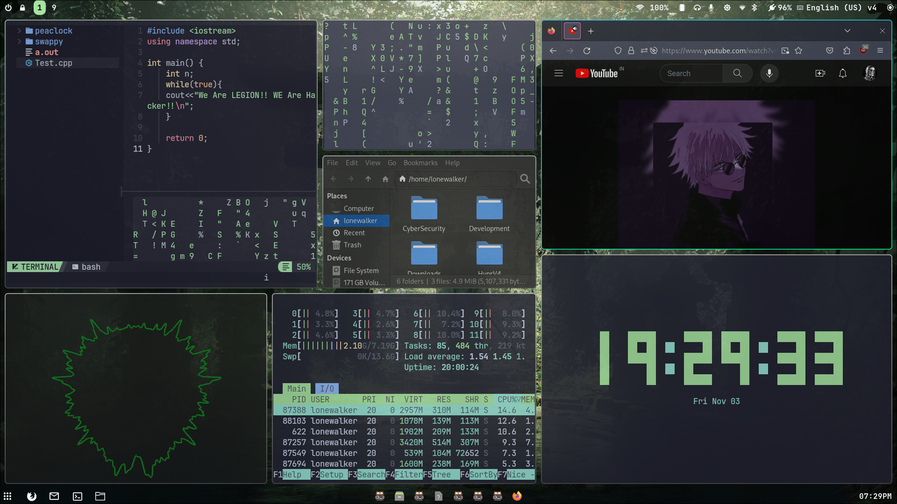

# hyprland Configuration Repository

This repository contains the configuration files used to develop the "hyprland" project on Arch Linux.

## Configuration Files

- `config_file_1.conf`: Description of config_file_1.
- `config_file_2.yml`: Description of config_file_2.
- ...

## Screenshots

Here are some screenshots of the "hyprland" project:




## Usage

You can clone this repository to your local machine using the following command:

```bash
git clone https://github.com/AtharvaT02/hyprland-config.git

